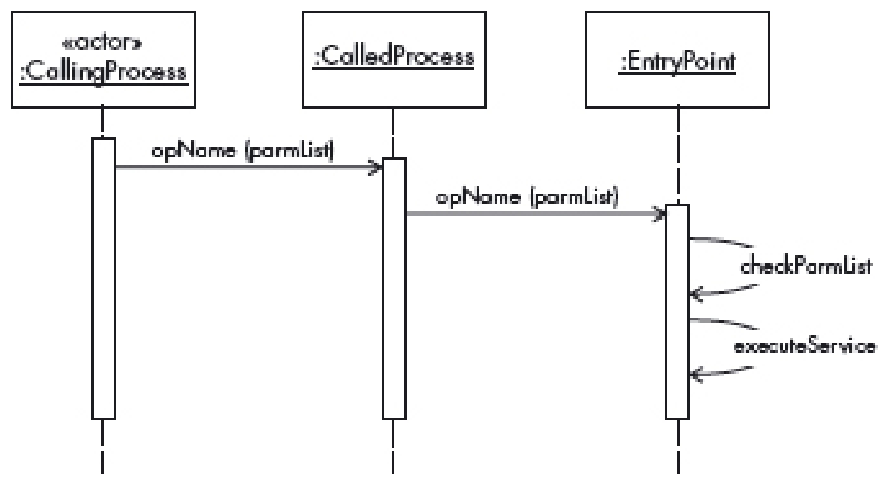

# **Protected Entry Points**

## **Intent**
The PROTECTED ENTRY POINTS pattern describes how to force a call from one process to another to go through only prespecified entry points where the correctness of the call is checked, and other access restrictions may be applied.

## **Example**
ChronOS is a company building a new operating system, including a variety of plug-in services such as media players, browsers, and others. In their design, processes can call each other in unrestricted ways. This makes process calls fast, which results in generally good performance, and everybody is satisfied. However, when they test the system, an error anywhere produces problems, because it propagates to other processes, corrupting their execution. Also, many security attacks are shown to be possible. It is clear that when their systems are in use, they will acquire a bad reputation and ChronOS will have problems selling it. They need to have a system that provides resilient service in the presence of errors, and which is resistant to attacks.

## **Context**
Executing processes in a computing system. Processes need to call other processes to ask for services or to collaborate in the computation of an algorithm, and usually share data and other resources. The environment can be centralized or distributed. Some processes may be malicious or contain errors.

## **Problem**
Process communication has an effect on security, because if a process calls another using entry points without appropriate checks, the calling process may read or modify data illegally, alter the code of the executing process, or take over its privilege level. If the checks are applied at specific entry points, some languages, such as C or C++, let the user manipulate pointers to bypass those entry points. Process communication also has a major effect on reliability because an error in a process may propagate to others and disrupt their execution. 

The solution to this problem must resolve the following forces:

- Executing processes need to call each other to perform their functions. For example, in operating systems user processes need to call kernel processes to perform I/O, communications and other system functions. In all environments, process may collaborate to solve a common problem, and this collaboration requires communication. All this means that we cannot use process isolation to solve this problem. 
- A call must go to a specified entry point or checks could be bypassed. Some languages let users alter entry point addresses, allowing input checks to be bypassed. 
- A process typically provides services to other processes, but not all services are available to all processes. A call to a service not authorized to a process can be a security threat or allow error propagation. 
- In a computing environment we have a variety of processes with different levels of trust. Some are processes that we normally trust, such as kernel processes; others may include operating system utilities, user processes and processes of uncertain origin. Some of these processes may have errors or be malicious. All calls need to be checked. 
- The number, type, and size of the passed parameters in a call can be used to attack a process, for example by producing a buffer overflow. Incorrect parameters may produce or propagate an error

## **Solution**
Systems that use explicit message passing have the possibility of checking each message to see if it complies with system policies. For example, one security feature that can be applied when calling another process is protected entry points. A process calling another process can only enter the called process at predesigned entry points, and only if the signature used is correct (name, number of parameters, type, and size of parameters). This prevents bypassing entry checks and avoids attacks such a buffer overflows.

## **Structure**
Figure 139 shows the class diagram of the solution. CallingProcess and CalledProcess are roles of processes in general. When a CallingProcess makes a request for a service to another process, the request is handled by an EntryPoint. This EntryPoint has a name and a list of parameters with predefined numbers, types, and size limits that can be used to check the correctness of the call signature. It can optionally add access control checks by using a REFERENCE MONITOR pattern or other input data tests.

*Figure 139: Class diagram for the PROTECTED ENTRY POINTS pattern*

## **Dynamics**
Figure 140 shows a CallingProcess performing a service call. The call must use a proper signature: that is, if the name of the service (opName) or the names of the parameters are incorrect, and the type or length of the parameters is not correct, it is rejected (this is checked by operation checkParmList).

*Figure 140: Sequence diagram for a process making a service call*

## **Implementation**
Kernels support calls as direct calls or through mailboxes. In the first case, the called process must check that the call is correct; in the second case, the mailbox must do the checking. 

Entry points must be expressed as references as in Java, and not as pointers, as in C or C++ (as pointers allow arithmetic operations). In languages that use pointers, it is necessary to restrict their use in procedure calls, for example by disallowing pointer arithmetic.

## **Example Resolved**
If the parameters of all calls are validated through protected entry points, many security and reliability problems can be avoided. Additional checks, such as access control and data value checks, can also be applied.

## **Consequences**
The PROTECTED ENTRY POINTS pattern offers the following benefits: 

- If we can check all the calls of one process to another, we can check that the calls are for appropriate services and apply checks for security or reliability purposes. 
- Checking the number, type and length of the parameters passed in a call can prevent a variety of attacks and stop the propagation of some errors. 
- If we know the level of trust of processes, we can adjust the number of checks; for example, we can apply more checks to suspicious processes.

## **Known Uses**
- Multics. 
- Systems that use ring architectures, for example the Intel Series 86 and Pentium. 
- Systems that use capabilities, such as IBM S/6000. 
- A specific use can be found in a patent for PC BIOS [1].

## **See Also**
- This pattern can be seen as a specific realization of the abstract principle validate input parameters. 
- The PROTECTION RINGS pattern. 
- MULTILEVEL SECURE PARTITIONS pattern. 
- The CAPABILITY pattern. 
- Access control and distributed access control. These checks can be applied in specific entry points to control access to resources.

## **References**

[1] Dayan, R. A., Geisler, D. R., Kinnear, S. G., Macon Jr, J. F., & Schwartz, W. H. (1991). *U.S. Patent No. 5,063,496*. Washington, DC: U.S. Patent and Trademark Office.

## **Source**
Fernandez-Buglioni, E. (2013). *Security patterns in practice: designing secure architectures using software patterns*. John Wiley & Sons.
